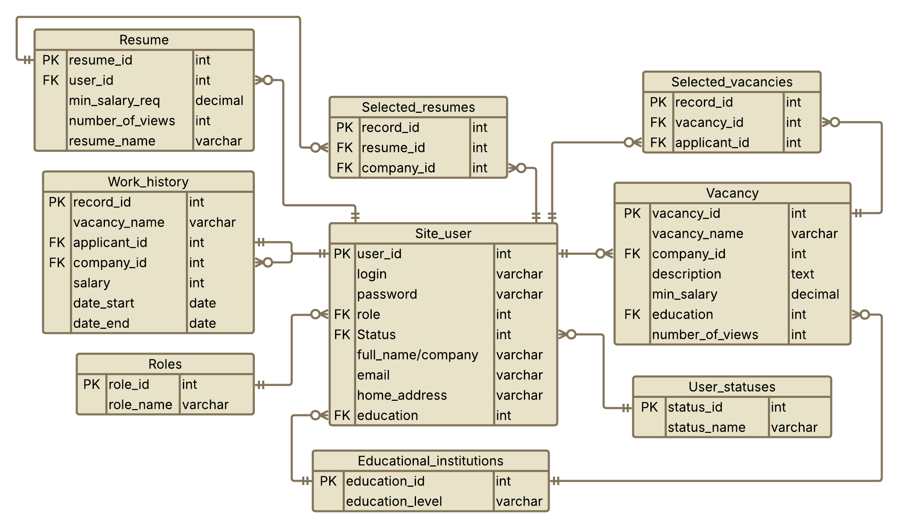

# Кадровое агентство

## Схема сайта

## Описание страниц
С любой страницы можно попасть на **Главную страницу**. С любой страницы, кроме **Страницы администратора**, **Страницы регистрации и входа** и **Страницы регистрации** можно попасть в **Личный кабинет**.

На сайте есть несколько **ролей**:
* Соискатель (Ap)
* Работодатель (Em)
* Администратор (Ad)

### Главная страница
* Кнопка перехода на **Страницу поиска вакансии**
* Кнопка перехода на **Страницу поиска резюме**
* Кнопка перехода в **Личный кабинет**
* Списком будут отображены самые популярные вакансии (в базе данных для этого храниться специальный атрибут)
* Списком будут отображены самые интересные резюме (в базе данных для этого храниться специальный атрибут)
* На всех вакансиях и резюме будет кнопка _Подробнее_, которая активирует переход на **Страницу информации о вакансии** или **Страницу ифнормации о резюме**

### Личный кабинет
* Фамилия Имя Отчество (Ap) или Название компании (Em)
* Email
* Домашний адрес (Ap)
* Статус соискателя (Информация о том, ищет ли он работу или нет) (Ap)
* Кнопка перехода на страницу **История работ пользователя** (Ap)
* Кнопка перехода на **Страницу всех вакансий компании** (Em)
* Кнопка перехода на **Страницу всех резюме пользователя** (Ap)
* Кнопка **Редактировать профиль** нужна чтобы изменить данные в профиле (осуществится переход на **Страницу изменения профиля**)
* Кнопка **Избранное** реализует переход на страницу с избранными вакансиями или резюме

### Страница регистрации и входа
* Поле для ввода логина
* Поле для ввода пароля
* Кнопка **Регистрация** (При отсутствии аккаунта/особом желании пользователь может зарегестрировать новый аккаунт)
* Кнопка **Войти** активирует начало проверки данных. При совпадении данных, введённых пользователем, происходит переход на **Главную страницу**. Если логин и пароль принадлежат администратору (Ad), то осуществляется переход на специальную **Страницу администратора**.

### Страница администратора (Ad)
* Поле для ввода команд, управляющих БД (Терминал БД)
* Поле для получения обратной и отладочной информации от БД

### Страница регистрации
* Поле для ввода Фамилии Имени и Отчества нового пользователя (Ap) или названия компании (Em)
* Домашний адрес (Ap)
* Поле для ввода логина нового пользователя
* Поле для ввода пароля нового пользователя
* Поле для подтверждения пароля, который пользователь ввёл выше
* Кнопка **Зарегистрироваться** инициирует запись нового пользователя в БД и осуществляет переход на **Страница регистрации и входа** (А также проверяется совпадение паролей, при несовпадении будет выведено сообщение об этом)

### Избранное
* Специальные фильтры для более удобного вывода информации
  * Вакансия
  * Работодатель
  * Заработная плата
  * Дата подачи
* Далее будут расположены все избранные резюме (Ap) и вакансии (Em) соответственно
* На каждом из пунктов списка будет кнопка **Подробнее**, которая реализует переход на страницу с подробной информацией о вакансии или резюме

### Страница поиска вакансий
* Специальные фильтры для более удобного вывода информации
  * Компания
  * Заработная плата
  * Должность
  * Степень образования
* Далее будет расположен список вакансий, удовлетворяющий условиям фильтрации
* На каждом из пунктов списка будет кнопка **Подробнее о вакансии**, которая реализует переход на **Страницу информации о вакансии**

### Страница иформации о вакансии
* Название вакансии
* Компания, которая выставила данное предложение
* Email
* Краткое или развёрнутое описание заявки
* Предлагаемая заработная плата
* Необходимое образование
* Требования к послужному списку
* Кнопка **Добавить в избранное** (При нажатии на неё создаётся запись в таблицу с избранными вакансиями. Её можно будет посмотреть в личном кабинете. При повторном нажатии избранность будет отменена, а запись об избранности вакансии будет удалена)

### Страница поиска резюме
* Специальные фильтры для более удобного вывода информации
  * Степень образования
  * Компании, в которых люди работали
  * Занимаемые должности
  * Требуемая заработная плата
* Далее будет расположен список резюме, удовлетворяющий условиям фильтрации
* На каждом из пунктов списка будет кнопка **Подробнее о резюме**, которая реализует переход на **Страницу информации о резюме**

### Страница информации о резюме
* Фамилия Имя Отчество
* Email
* Домашний адрес
* Образование
* Заработная плата, которую хочет соискатель
* Прошлый опыт в компаниях
* Занимаемые должности
* Кнопка **Добавить в избранное** (При нажатии на неё создаётся запись в таблицу с избранными резюме. Её можно будет посмотреть в личном кабинете. При повторном нажатии избранность будет отменена, а запись об избранности резюме будет удалена)

### История работ пользователя
* Специальные фильтры для более удобного вывода информации
  * Название компании
  * Должность
  * Заработная плата
  * Временной интервал
* Далее будет список строк, содержащих краткую информацию о послужном списке соискателя:
  * Название компании
  * Должность
  * Заработная плата
  * Даты начала работы на этой должности
  * Даты окончания работы на этой должности
* Кнопка **Добавить запись** активирует переход на **Страницу новой записи**

### Страница новой записи
* Поле для ввода названия компании
* Поле для ввода должности
* Поле для ввода заработной платы
* Поле для ввода даты начала работы на этой должности
* Поле для ввода даты окончания работы на этой должности
* Кнопка **Подтвердить** сохраняет новую запись и осуществляет переход обратно на страницу **История работ пользователя**

### Страница всех вакансий компании (Em)
* Специальные фильтры для более удобного вывода информации
  * Должность
  * Заработная плата
  * Необходимая ступень образования
  * Требования к послужному списку
* Далее будет расположен список вакансий, удовлетворяющий условиям фильтрации
* На каждом из пунктов списка будет кнопка **Подробнее о резюме**, которая реализует переход на **Страницу вакансии**
* Кнопка **Создать вакансию** активирует переход на **Редактор вакансии** для создания новой записи

### Редактор вакансии (Em)
* Поле для ввода должности
* Поле для ввода компании (Например, если работодателю нужно создать вакансию от имени дочернего предприятия)
* Поле для ввода описания
* Поле для ввода заработной платы
* Поле для ввода необходимого образования
* Поле для ввода требований к послужному списку
* Кнопка **Подтвердить** сохраняет новую заявку или исправляет старую запись о вакансии и активирует переход обратно на **Страницу всех вакансий компании**
* Кнопка **Удалить вакансию** удаляет существующую вакансию и активирует переход обратно на **Страницу всех вакансий компании**

### Страница всех резюме пользователя
* Специальные фильтры для более удобного вывода информации
  * Должность
  * Образование (Возможно на разные вакансии нужны разные дипломы)
  * Заработная плата
  * Опыт в компаниях (Для работодателя могут быть важны схожие компании)
  * Занимаемые должности (На разные должности важны близкий должности)
* Далее будет расположен список резюме, удовлетворяющий условиям фильтрации
* На каждом из пунктов списка будет кнопка **Подробнее о резюме**, которая реализует переход на **Страницу резюме**
* Кнопка **Создать резюме** активирует переход на **Редактор резюме** для создания новой записи

### Редактор резюме (Ap)
* Поле для ввода Фамилии Имени Отчества
* Поле для ввода образования (Возможно на разные вакансии нужны разные дипломы)
* Поле для ввода требования к заработной плате
* Поле для ввода опыта работы в компаниях (Для работодателя могут быть важны схожие компании)
* Поле для ввода занимаемых должностей (На разные должности важны близкий должности)
* Кнопка **Подтвердить изменения** сохраняет новую заявку или исправляет старую запись о вакансии и активирует переход обратно на **Страницу всех резюме пользователя**
* Кнопка **Удалить резюме** удаляет существующее резюме и активирует переход обратно на **Страницу всех резюме пользователя**

### Страница изменения профиля
* Поле для ввода Фамилии Имени Отчества
* Поле для ввода Email
* Поле для ввода домашнего адреса
* Поле для выбора статуса (Ищет ли пользователь рабочее место для своих резюме)
* Кнопка **Подтвердить изменения** исправляет старую запись профиля и активирует переход обратно в **Личный кабинет**

## Сценарии использования

1. Получение списка резюме по образованию, компаниям, в которых люди работали, по занимавшимся должностям, зарплатам
    * На **Главной странице** нажать кнопку _Поиск резюме_ ➤ На **Страница поиска резюме** выставить необходимые фильтры
2. Получение списка вакансий по компаниям, должностям, зарплатам
    * На **Главной странице** нажать кнопку _Поиск вакансий_ ➤ На **Страница поиска вакансий** выставить необходимые фильтры
3. Получение истории работы для данного человека
    * На **Главная странице** нажать кнопку _Личный кабинет_ ➤ В **Личном кабинете** нажать на кнопку _История работ_
4. Поиск подходящих вакансий на резюме и подходящих резюме на вакансию
    * На **Главной странице** нажать кнопку _Поиск вакансий_ ➤ На **Страница поиска вакансий** выставить необходимые фильтры
    * На **Главной странице** нажать кнопку _Поиск резюме_ ➤ На **Страница поиска резюме** выставить необходимые фильтры
5. Добавление и удаление данных о человеке, чтение и редактирование данных о нем, добавление данных о новом трудоустройстве
    * На **Странице регистрации и входа** нажать кнопку _Регистрация_ ➤ На **Странице регистрации** ввести данные человека и нажать кнопку _Зарегистрироваться_
    * На **Странице регистрации и входа** ввести логин и пароль администратора и нажать кнопку _Войти_ ➤ На **Странице администратора** в _Поле для команд_ ввести команды, необходимые для удаления пользователя (Ad)
    * На любой странице нажать кнопку _Личный кабинет_ (Она будет расположена в верхнем углу сайта; На **Главной странице** будет ещё и кнопка _Личный кабинет_)
    * На **Главной странице** нажать кнопку _Личный кабинет_ ➤ В **Личном кабинете** нажать на кнопку _Редактировать профиль_ ➤ На **Странице изменения профиля** ввести или исправить необходимые данные и нажать на кнопку _Подтвердить изменения_
    * На любой странице нажать кнопку _Личный кабинет_ ➤ В **Личном кабинете** нажать кнопку _История работ_ ➤ На странице **История работ пользователя** нажать кнопку _Добавить запись_ ➤ На **Странице новой записи** ввести необходимые данные (Ap)
6. Добавление и удаление компании, чтение и редактирование данных о них, добавление, удаление и редактирование вакансий
    * На **Странице регистрации и входа** нажать кнопку _Регистрация_ ➤ На **Странице регистрации** ввести данные компании и нажать кнопку _Зарегистрироваться_
    * На **Странице регистрации и входа** ввести логин и пароль администратора и нажать кнопку _Войти_ ➤ На **Странице администратора** в _Поле для команд_ ввести команды, необходимые для удаления пользователя (Ad)
    * На любой странице нажать кнопку _Личный кабинет_
    * На **Главной странице** нажать кнопку _Личный кабинет_ ➤ В **Личном кабинете** нажать на кнопку _Редактировать профиль_ ➤ На **Странице изменения профиля** ввести или исправить необходимые данные и нажать на кнопку _Подтвердить изменения_
    * На любой странице нажать кнопку _Личный кабинет_ ➤ В **Личном кабинете** нажать кнопку _Мои вакансии_ ➤ На **Странице всех вакансии компании** нажать кнопку _Создать вакансию_ ➤ На **Странице вакансии** ввести необходимые данные и нажать кнопку _Подтвердить изменения_ (Ap)
    * На любой странице нажать кнопку _Личный кабинет_ ➤ В **Личном кабинете** нажать кнопку _Мои вакансии_ ➤ На **Странице всех вакансии компании*** на нужной записи нажать кнопку _Подробнее о резюме_ ➤ На **Странице вакансии** нажать кнопку _Удалить вакансию_ (Ap)
    * На любой странице нажать кнопку _Личный кабинет_ ➤ В **Личном кабинете** нажать кнопку _Мои вакансии_ ➤ На **Странице всех вакансии компании** нажать кнопку _Создать вакансию_ ➤ На **Странице вакансии** ввести необходимые данные и нажать кнопку _Подтвердить изменения_ (Ap)

## Схема базы данных сайта

## Ссылки

:link: [Схема для навигации по сайту](https://lucid.app/lucidchart/a6af747b-6c6d-4f59-aaa1-a0dbc57633f6/edit?viewport_loc=-2723%2C-1153%2C7703%2C3775%2C0_0&invitationId=inv_c224ca37-4974-4817-ab0c-7283a90b435d)
 
:link: [База данных сайта](https://lucid.app/lucidchart/7a7d68a0-9e5e-422f-9425-8dd1acd80e99/edit?viewport_loc=-609%2C-1109%2C4037%2C1978%2C0_0&invitationId=inv_4ccf47c9-7e6a-4e33-99c8-0b6a56a0c30f)
